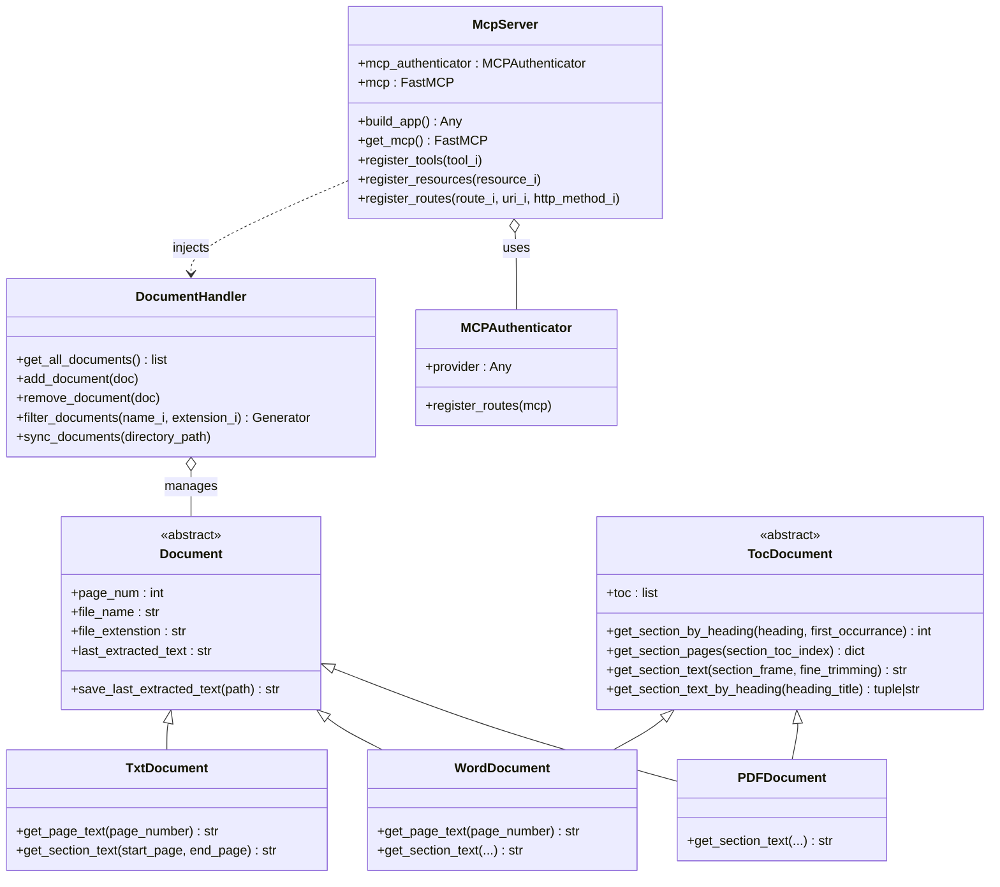

# Semantic Finder

Semantic Finder is a powerful document management and search utility designed to expose local documents to LLMs via the Model Context Protocol (MCP). It provides an intelligent backend for reading, parsing, and extracting specific sections from various document formats, making it easy for an AI agent to perform semantic searches, read table of contents, and answer questions based on your local files.

## Overview

The application is structured into two main packages:
1. **`docspkg`**: The document processing engine. It handles loading documents, parsing their structures (like Table of Contents), and extracting text by page or by semantic sections (e.g., chapters or headings).
2. **`mcppkg`**: The MCP server implementation. It wraps the document capabilities into standard MCP tools and resources that an AI client can consume.

---

## Architecture & Modules



### Implementation Details

The system heavily relies on core Object-Oriented Programming principles and advanced Python features to maintain a clean, extensible codebase:
- **Inheritance & Polymorphism:** The system uses inheritance to specialize document behavior. `PDFDocument`, `WordDocument`, and `TxtDocument` inherit from the base `Document` class. `PDFDocument` and `WordDocument` also inherit from `TocDocument`. This allows the `DocumentHandler` to treat all documents uniformly, calling polymorphic methods like `get_section_text` without needing to know the specific underlying file type.
- **Abstract Classes:** `Document` and `TocDocument` are implemented as Abstract Base Classes (`ABC`). They enforce a strict contract using the `@abstractmethod` decorator, ensuring all derived classes implement the necessary core functionalities.
- **Properties:** The `@property` decorator is used extensively (e.g., for `page_num`, `toc`, `file_name`) to cleanly encapsulate internal state, provide read-only access where appropriate, and hide complex derivation logic from the caller.
- **Iterables:** `DocumentHandler` is designed as an iterable collection by implementing the `__iter__` dunder method. Furthermore, methods like `filter_documents` return Python `Generator`s, allowing memory-efficient iteration over large sets of documents.
- **Callables:** The `McpServer` class implements the `__call__` dunder method. This makes the server instance itself callable, providing a clean and intuitive entry point to start the application (e.g., `server()` in `main.py`).

### 1. `docspkg` (Document Processing)

The document package provides an object-oriented approach to handling different file formats:

- **`Document` (`document.py`)**: An abstract base class representing a generic document. It provides a unified interface for managing common properties like file paths, names, extensions, and page numbers.
- **`TocDocument` (`toc_document.py`)**: An abstract interface for documents that contain a hierarchical Table of Contents (TOC). It defines methods for finding sections by heading and extracting the text within those sections.
- **`PDFDocument` (`pdf_document.py`)**: Maintains an internal representation of a PDF file using `pymupdf`. It can search through the PDF's TOC and extract text from specific chapters or sections.
- **`WordDocument` (`word_document.py`)**: Maintains an internal representation of a DOCX file using `python-docx`. It dynamically builds a TOC by parsing heading styles and allows text extraction per page and section.
- **`TxtDocument` (`txt_document.py`)**: Maintains an internal representation of a TXT file. Since plain text lacks built-in pagination, it virtually paginates the document (e.g., 500 words per page) and provides methods to extract text intervals.
- **`DocumentHandler` (`document_handler.py`)**: The central manager for the documents. It synchronizes with a local directory (specified via environment variables), keeps the active documents in memory, and provides generators to filter documents by name or extension.

### 2. `mcppkg` (MCP Server Integration)

The MCP package leverages `FastMCP` to expose the document capabilities to the outside world:

- **`McpServer` (`server.py`)**: Encapsulates the FastMCP server, configuring authentication, custom routes, tools, and resources. It manages the ASGI application lifecycle and injects the `DocumentHandler` into the server context.
- **`tools.py`**: Defines the MCP tools that an AI agent can execute:
  - `get_documents_toc`: Retrieves the table of contents for documents matching a specific keyword, allowing clients to understand what topics the documents cover.
  - `get_documents_text`: Retrieves the exact text of a specific section (by heading) across matching documents.
  - `analyze_txt_document`: Analyzes plain text files page-by-page based on a query keyword.
  - `get_current_time`: A utility tool to get the current system time.
- **`resources.py`**: Exposes the available documents as MCP resources (e.g., listing all documents, filtering by name, or filtering by extension).
- **`authentication.py`**: Provides authentication middleware and logic to secure the MCP server endpoints.
- **`routes.py`**: Defines standard HTTP endpoints, such as a `/health` check.

---

## Usage

### Prerequisites
- Python 3.10+
- `fastmcp`
- `pymupdf` (for PDF support)
- `python-docx` (for Word support)

### Running the Server

To run the MCP server, ensure you have your environment variables set up (particularly `LOCAL_PATHS` which points to the directory containing your documents, and `MCP_PORT`), and execute the main entry point:

```bash
python main.py
```

This will start the FastMCP server on `127.0.0.1` at the configured port (default is `8001`), ready to accept connections from an MCP client. The server will automatically sync and index all supported documents (`.pdf`, `.docx`, `.txt`) found in the `LOCAL_PATHS` directory.

### Extending the Capabilities

To add support for a new document format:
1. Create a new class in `docspkg` that inherits from `Document` (and `TocDocument` if applicable).
2. Implement the required abstract methods (e.g., `page_num`, text extraction).
3. Update the `sync_documents` method in `DocumentHandler` to instantiate your new class when it encounters the corresponding file extension.

### Example Interaction

Here is an example of how an AI agent uses the exposed MCP tools to answer user queries:

**User**: Which word (docx) documents do I have in my local database?

**AI**: Based on the information retrieved from your local database via the MCP server, you have the following Word (`.docx`) documents available:
- `Dante.docx`
- `Leopardi.docx`

**User**: What are the topics of Dante.docx?

**AI**: Based on the Table of Contents I retrieved earlier, the topics (sections) in **Dante.docx** are structured as follows:
- **Divina commedia**
  - Canto I to Canto X
- **EOF** (End of File)

**User**: Can you talk me about Canto I from Dante.docx?

**AI**: Based on the content extracted from **Dante.docx**, here is the summary of **Canto I**:
Dante finds himself lost in a "selva oscura" (dark forest), which is a symbol of sin and his own spiritual crisis. He tries in vain to climb a sunlit hill, but his path is blocked by "tre fiere" (three wild beasts) that represent moral and political obstacles.
Just when it seems there is no way out for him, the ancient Roman poet Virgilio (Virgil) appears. Virgilio offers to guide Dante on a journey through Hell (Inferno) and Purgatory (Purgatorio) so that he can ultimately reach salvation.
